# 🧪 Test API – Auth Module (Local + Google OAuth)

Tài liệu hướng dẫn test các API của hệ thống Auth, bao gồm **Local Auth** (signup, signin, forgot/change password) và **Google OAuth2**.

---

## 1. Local Auth – `/user`

### 🔹 Đăng ký
```http
POST http://localhost:3000/user/signup
Content-Type: application/json

{
  "username": "admin",
  "email": "admin@example.com",
  "password": "12345",
  "confirmPassword": "12345"
}
```
✅ Kết quả: User mới được lưu trong MongoDB.  

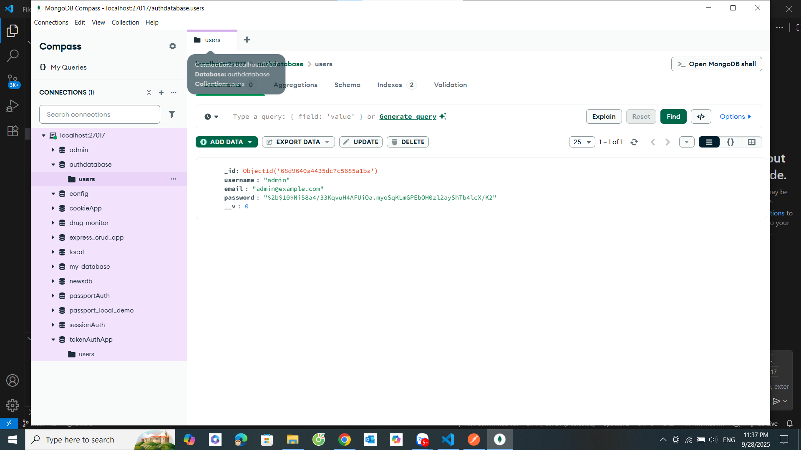

---

### 🔹 Đăng nhập
```http
POST http://localhost:3000/user/signin
Content-Type: application/json

{
  "email": "admin@example.com",
  "password": "12345"
}
```
✅ Kết quả: `"Login successful!"` và cookie `connect.sid` được tạo.  
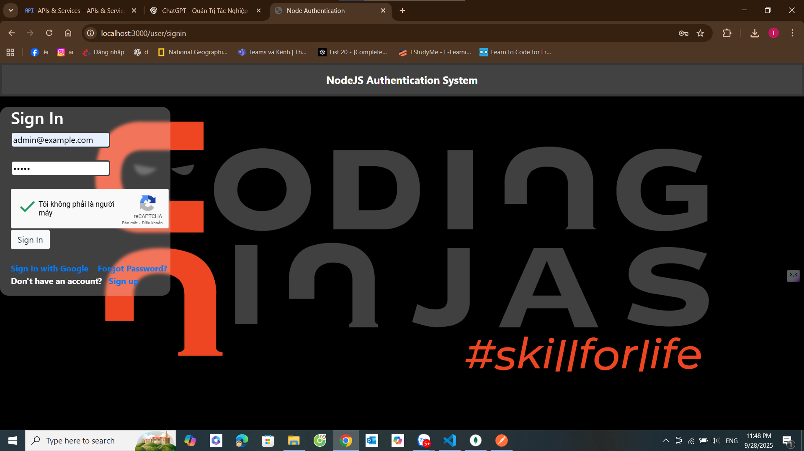
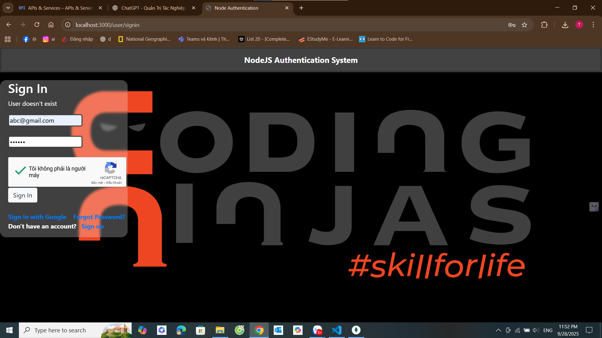

---

### 🔹 Truy cập Homepage (Profile)
```http
GET http://localhost:3000/user/homepage
```
- Nếu **session hợp lệ** → trả về trang homepage hoặc thông tin user.  
- Nếu chưa đăng nhập/hết hạn → `401 Unauthorized`.  

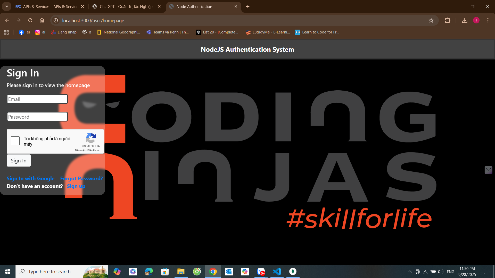


---

### 🔹 Đăng xuất
```http
GET http://localhost:3000/user/signout
```
✅ Kết quả: `"Logout successful!"`, session bị xóa khỏi DB, cookie hết hiệu lực.  
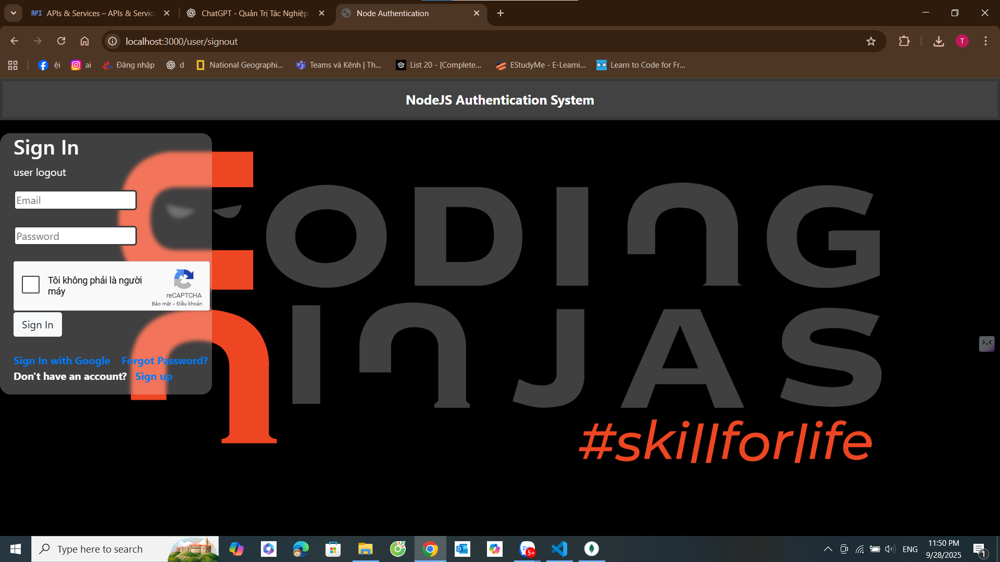

---

### 🔹 Quên mật khẩu
```http
POST http://localhost:3000/user/forgot-password
Content-Type: application/json

{
  "email": "admin@example.com"
}
```
✅ Kết quả: `"Reset link sent to email"` (nếu email tồn tại).  

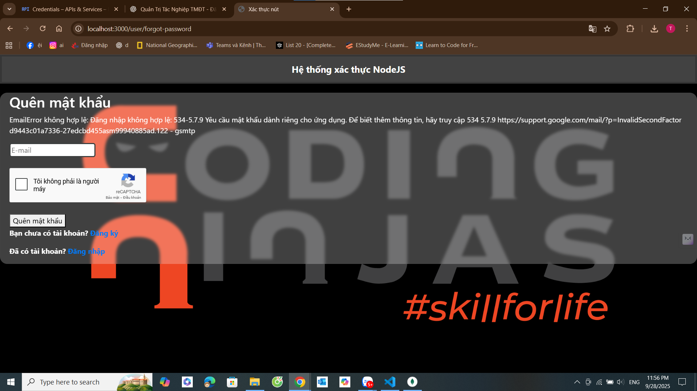

---

### 🔹 Đổi mật khẩu
```http
POST http://localhost:3000/user/change-password
Content-Type: application/json

{
  "oldPassword": "12345",
  "newPassword": "67890",
  "confirmPassword": "67890"
}
```
✅ Kết quả: `"Password changed successfully!"`.  
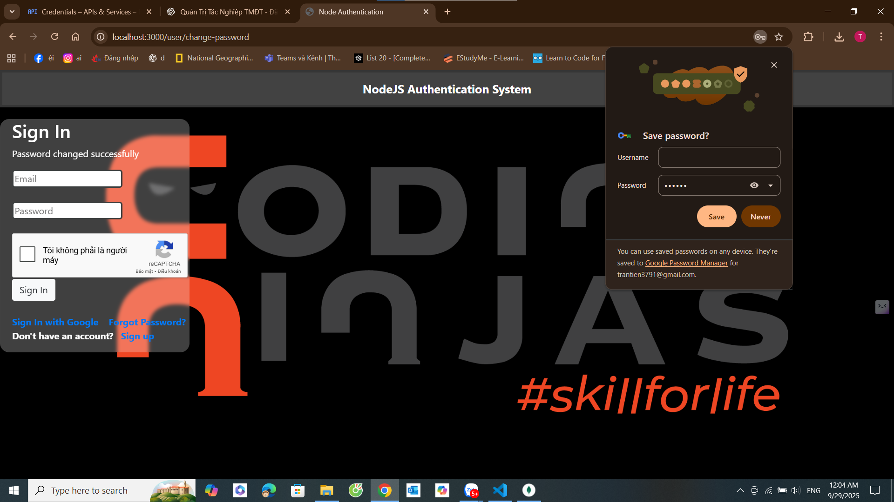
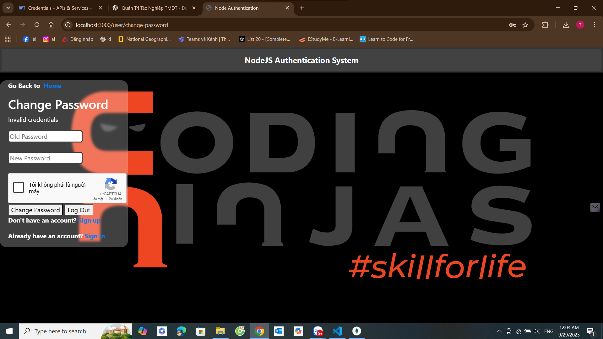

---

## 2. Google OAuth2 – `/auth`

### 🔹 Đăng nhập với Google
```http
GET http://localhost:3000/auth/google
```
✅ Redirect sang trang Google Login.  
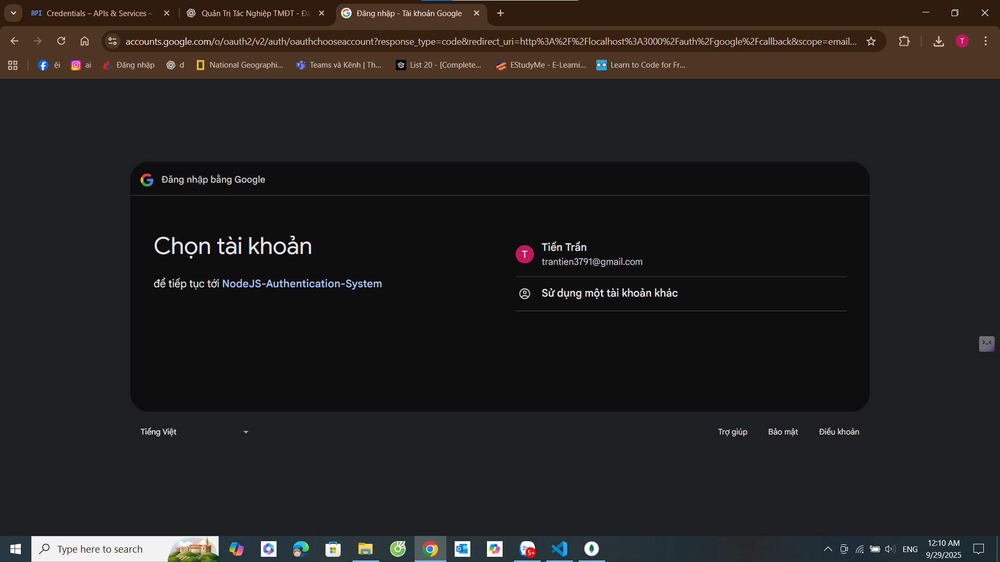


---

### 🔹 Callback từ Google
```http
GET http://localhost:3000/auth/google/callback
```
- Nếu thành công → redirect về `CLIENT_URL` (trong `.env`).  
- Nếu thất bại → redirect `/login/failed`.  
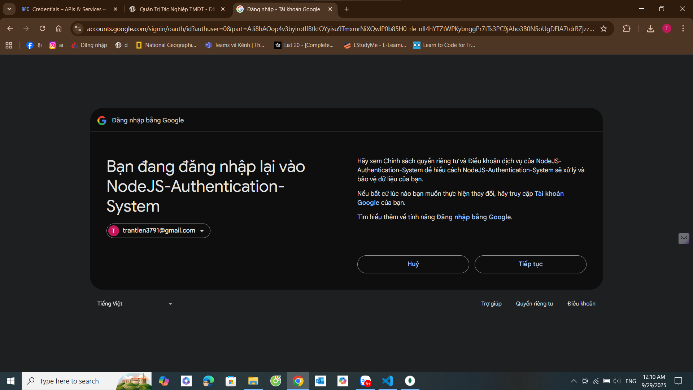

---

### 🔹 Lấy thông tin user sau khi login Google
```http
GET http://localhost:3000/auth/login/success
```
✅ Kết quả: JSON thông tin user (name, email, avatar…).  
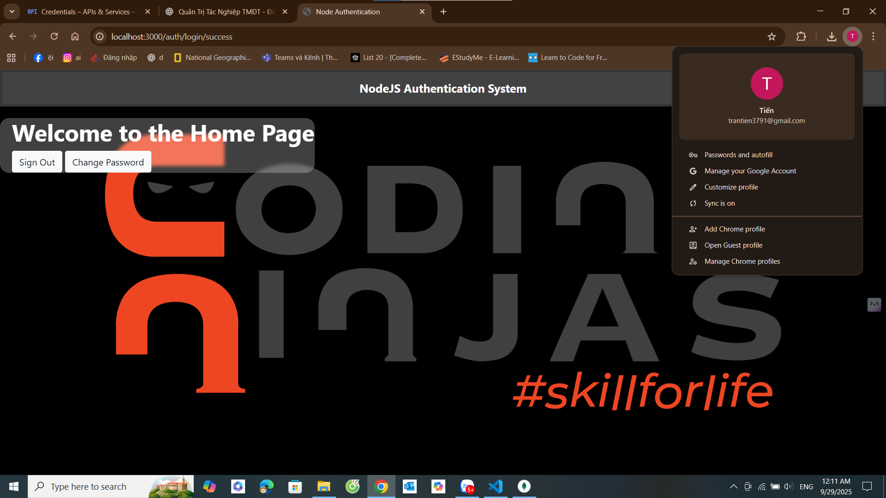

---

### 🔹 Login thất bại
```http
GET http://localhost:3000/auth/login/failed
```
✅ Kết quả: `{ "error": "Login failed" }`.  
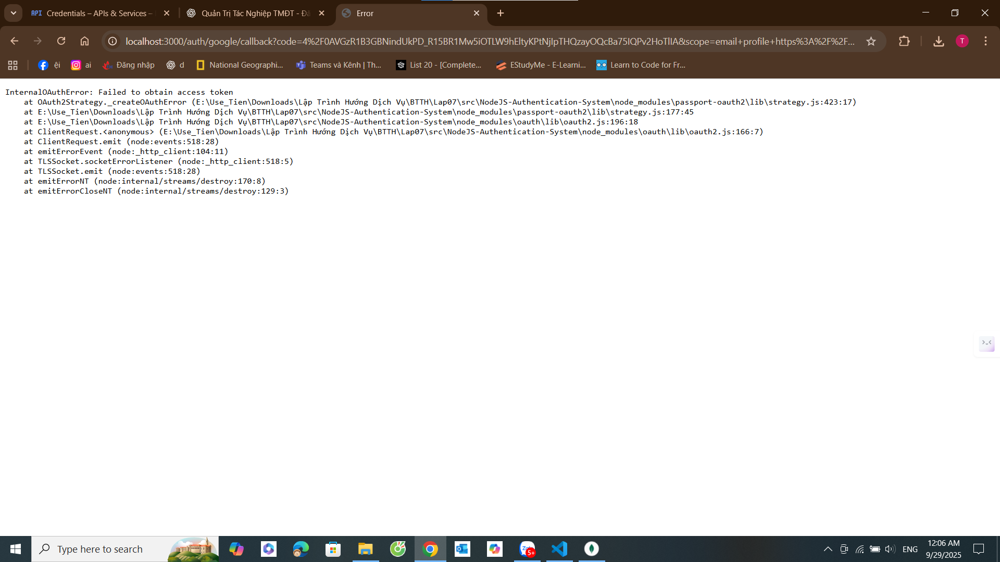

---

## 📂 Thư mục ảnh đề xuất

```
public/
  results/
    register.png
    login.png
    profile.png
    logout.png
    forgot.png
    change.png
    google-login.png
    google-callback.png
    login-success.png
    login-failed.png
```

---

## ⚠️ Lưu ý
- Cần bật MongoDB trước khi test.  
- `CALLBACK_URL` phải trùng cấu hình trong Google Cloud Console.  
- Production: bật HTTPS + `cookie.secure=true`.  

---
